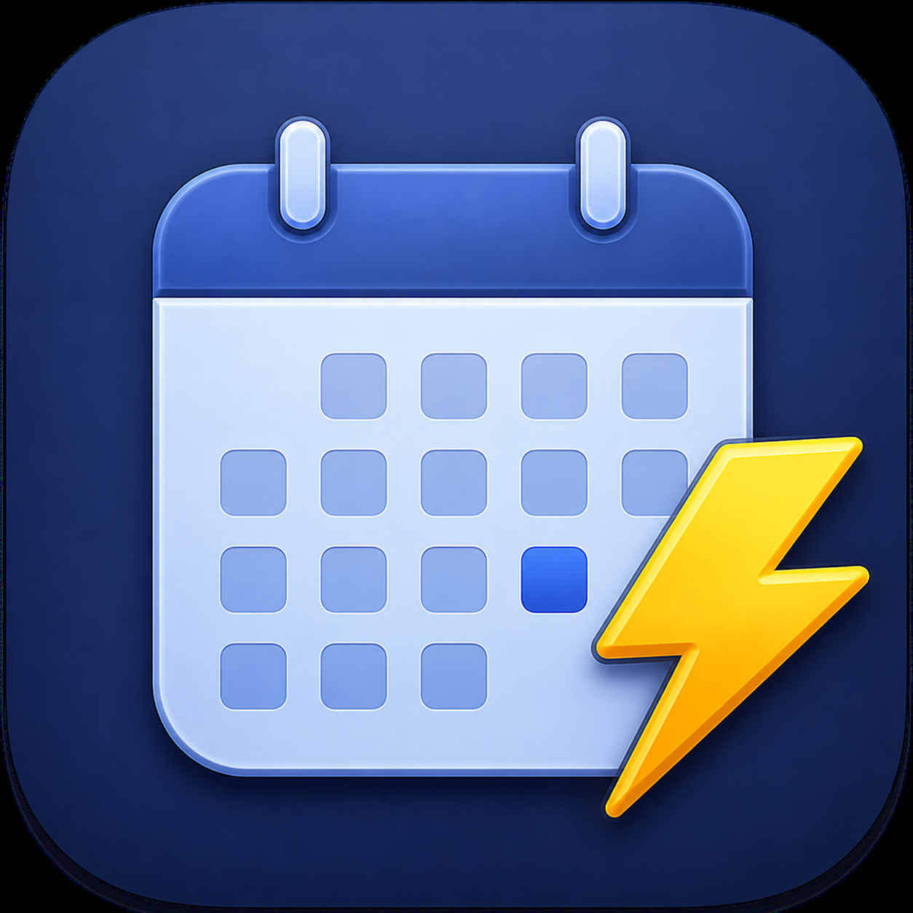

<p align="center">
  
</p>

<h1 align="center">QuickCal</h1>

<p align="center">
  A macOS menu bar app for professionals working with global teams.<br/>
  One click gives you a full calendar, world clock, and a natural-language time assistant — all without leaving what you're doing.
</p>

<p align="center">
  
  
  
  
</p>

---

## Why QuickCal

When your team spans multiple continents, a simple clock isn't enough. You need to know it's already Friday in Singapore while it's still Thursday in New York. You need to know that next Monday is a bank holiday in the UK before you schedule that all-hands. You need to know how many business days are left in the quarter.

QuickCal puts all of that in your menu bar — no subscriptions, no accounts, no internet required.

---

## Features

### 📅 Calendar
- Full month calendar with **← →** arrow key navigation and **Space** to jump to today
- Click any date to see its stats in the panel below
- Optional **ISO week numbers** in the left gutter
- Configurable **week start** — Sunday or Monday

### 🌍 International Holidays
Holidays from **16 countries** displayed as colored dots directly on the calendar grid. Enable any combination in Settings — perfect for teams spread across multiple regions.

| | | | |
|---|---|---|---|
| 🇺🇸 United States | 🇫🇷 France | 🇯🇵 Japan | 🇰🇷 South Korea |
| 🇬🇧 United Kingdom | 🇩🇪 Germany | 🇧🇷 Brazil | 🇸🇬 Singapore |
| 🇨🇦 Canada | 🇮🇹 Italy | 🇲🇽 Mexico | 🇵🇱 Poland |
| 🇦🇺 Australia | 🇪🇸 Spain | 🇳🇱 Netherlands | 🇮🇳 India |

**Dot colors:**
- 🟠 **Orange** — National / Federal holiday
- 🩵 **Teal** — Regional or observance varies
- ⭕ **Hollow ring** — Observed date (weekend shift to nearest weekday)

Hover any dot to see the holiday name, country, and type.

### 📊 Calendar Stats Panel
Always-visible panel below the calendar grid:
- **Moon phase** — current phase with SF Symbol icon and name
- **Season** — meteorological season with day count
- **Year progress** — accent-color progress bar with percentage
- **Day stats** — day of year, week number, days left in year, business days left in month

### 🕐 World Clock
- **Local time** always shown at top with live seconds and country flag
- First launch pre-populates with New York, London, Paris, Singapore, Mumbai, Tokyo, Sydney
- Add any timezone — 30 popular suggestions + full 600+ IANA search
- **Drag to reorder** panels
- **Rename** any zone — call it "Office" or "Client" instead of "London"
- **Pin** any timezone to the menu bar — shows `🇬🇧 9:41 PM` next to the icon at a glance
- Toggle between UTC offset (`UTC+2`) and offset from local time (`+6h`)

### 💬 Natural Language Q&A
Type a plain-English question. Everything is answered locally — no AI API, no network call.

**Time & conversion:**
```
what time in Tokyo
convert 3pm EST to London time
9am Mumbai in New York
```

**Day & date:**
```
what day is next Friday
first Monday in October 2027
last Friday of November
```

**Countdowns & math:**
```
how many days until Christmas
90 days from today
June 1 minus 3 weeks
business days between March 1 and April 15
```

**Periods & quarters:**
```
days left in Q3
when does Q4 start
is 2028 a leap year
how many business days in July
```

**Holidays:**
```
when is Thanksgiving 2027
when is Bastille Day 2028
is November 11 a holiday
```

80+ city/timezone aliases supported (SF, NYC, DC, HK, etc.)

### ⚙️ Settings
| Setting | Default |
|---|---|
| Launch at Login | Off |
| Global Hotkey | ⌥Space *(None / ⌥Space / Custom)* |
| Show Holidays + per-country checkboxes | On (US only) |
| Week Starts on Monday | Off |
| Show Week Numbers | Off |
| 24-Hour Time | Off |
| Show Offset from Local Time | On |

---

## Holiday Accuracy

Fixed-date, Easter-based, and floating weekday holidays are computed algorithmically and accurate for any year. Lunar and Islamic holidays (India, Singapore, South Korea, Japan) are hardcoded through **2030**. Regional, state-level, and proclaimed holidays are not included. Dates are best-effort and should be verified for business-critical planning.

---

## Requirements

- macOS 14 (Sonoma) or later
- Apple Silicon or Intel Mac

---

## Building

1. Clone the repo
2. Open `QuickCal.xcodeproj` in Xcode
3. Select the **QuickCal** scheme
4. Build and run — `⌘R`

No external dependencies. No Swift packages to resolve.

---

## About

Made by [Dejatech Solutions](https://dejatechsolutions.com) · QuickCal v1.0
